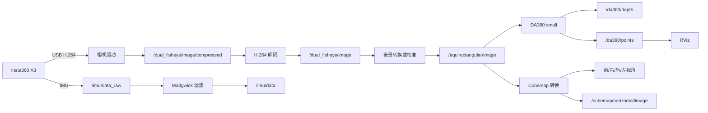

# Insta360 X3 ROS 2 全景深度与点云

本项目在 Ubuntu 22.04 / ROS 2 Humble 上把 Insta360 X3 实时视频处理为
1440×720 全景图、Cubemap 四视角、DA360 small 相对深度和带 RGB 的点云，并用
RViz 显示。相机、全景、Cubemap、深度模型和启动文件都由同一个仓库管理。

```text
Insta360 X3 -> H.264 双鱼眼 -> 解码 -> 等距柱状全景
                                      ├-> Cubemap
                                      └-> DA360 深度 -> PointCloud2 -> RViz
```

主要功能：

1. **相机采集**：通过 USB 连接 Insta360 X3，实时发布双鱼眼视频和 IMU 数据。
2. **视频解码**：将相机输出的 H.264 视频解码为 ROS 2 图像话题。
3. **全景转换**：把双鱼眼画面转换为 1440×720 等距柱状全景图。
4. **深度估计**：使用 DA360 small 从全景图生成相对深度图。
5. **点云生成**：将深度和全景颜色转换为带 RGB 的球面 `PointCloud2`。
6. **Cubemap 输出**：生成 FRONT、RIGHT、BACK、LEFT 四个视角及组合预览图。
7. **可视化**：自动启动 RViz 显示点云，也支持关闭 RViz 或窗口后台运行。
8. **实时校准**：通过滑块调整中心、裁剪、平移和旋转，并直接保存校准参数。
9. **统一管理**：一个脚本启动全部节点；核心节点退出时自动关闭整条流程。
10. **环境锁定**：使用 `pyproject.toml` 和 `uv.lock` 固定 Python/CUDA 依赖版本。

数据流：



## 一、配置环境

需要 Ubuntu 22.04、ROS 2 Humble、Python 3.10、Insta360 X3 CameraSDK 和支持
PyTorch 的 NVIDIA GPU。CameraSDK 和模型权重需要分别从官方来源下载。

```bash
git clone https://github.com/lchangy/insta360x3.git
cd instax3

./install_camera_sdk.sh /path/to/extracted/CameraSDK

mkdir -p insta360_ros_driver/da360_runtime/checkpoints
# 从下方 DA360 官方模型地址下载 DA360_small.pth，并放入上述目录

curl -LsSf https://astral.sh/uv/install.sh | sh
uv venv --python /usr/bin/python3 --system-site-packages
uv sync --frozen

source /opt/ros/humble/setup.bash
rosdep install --from-paths insta360_ros_driver --ignore-src -r -y
colcon build --symlink-install --packages-select insta360_ros_driver
./insta360_ros_driver/setup.sh
```

DA360 small 模型不上传到本仓库。请从
[DA360 官方 Google Drive](https://drive.google.com/drive/folders/1FMLWZfJ_IPKOa_cEbVqrq8_BRkl3oB_2?usp=drive_link)
下载 `DA360_small.pth`，保存为：

```text
insta360_ros_driver/da360_runtime/checkpoints/DA360_small.pth
```

当前验证文件的 SHA-256：

```text
cba5dfeeb2199b4a7089a98ce08c7506c1e5ea12b22c3e4ad51cbdb15150dd74
```

参考仓库：

1. [Insta360 desktop CameraSDK](https://github.com/insta360develop/desktop-camerasdk-cpp)：相机连接与视频流 SDK。
2. [ai4ce/insta360_ros_driver](https://github.com/ai4ce/insta360_ros_driver)：ROS 2 相机驱动基础。
3. [Insta360 Research DA360](https://github.com/Insta360-Research-Team/DA360)：全景深度模型、运行时代码和权重来源。
4. [Insta360 Research DAP](https://github.com/Insta360-Research-Team/DAP)：全景/Cubemap 相关实现参考。
5. [Depth Anything V2](https://github.com/DepthAnything/Depth-Anything-V2)：DA360 网络基础实现之一。

相机需要插入 microSD 卡、切换到双镜头模式，并把 USB 模式设置为 **Android**。
完整的系统依赖和逐步说明见 [DEPLOYMENT.md](DEPLOYMENT.md)。第三方授权说明见
[THIRD_PARTY_NOTICES.md](THIRD_PARTY_NOTICES.md)。

## 二、启动方式与模式

| 模式 | 命令 |
| --- | --- |
| 完整流程：相机、全景、Cubemap、DA360、IMU、RViz | `./start_pointcloud_pipeline.sh` |
| 实时校准，其他模块继续运行 | `./start_pointcloud_pipeline.sh --calibrate` |
| 不启动 RViz | `./start_pointcloud_pipeline.sh --no-rviz` |
| 发布 Cubemap 但不打开窗口 | `./start_pointcloud_pipeline.sh --cubemap-no-gui` |
| 完全关闭 Cubemap | `./start_pointcloud_pipeline.sh --no-cubemap` |
| 低界面负载校准 | `./start_pointcloud_pipeline.sh --calibrate --cubemap-no-gui --no-rviz` |

校准模式启动命令：

```bash
cd /path/to/instax3
./start_pointcloud_pipeline.sh --calibrate
```

该命令会打开校准滑块窗口，同时继续运行 Cubemap、DA360 点云和 RViz。拖动滑块
调整中心、裁剪、平移和旋转参数；在校准图像窗口按 `s` 保存到
`insta360_ros_driver/config/equirectangular.yaml`，按 `q` 或在启动终端按
`Ctrl+C` 关闭整条流程。

如果校准时界面负载较高，可以关闭 Cubemap 窗口和 RViz：

```bash
./start_pointcloud_pipeline.sh --calibrate --cubemap-no-gui --no-rviz
```

其他参数：

```bash
./start_pointcloud_pipeline.sh --cubemap-face-size 512
./start_pointcloud_pipeline.sh --point-stride 2
./start_pointcloud_pipeline.sh --model-path /path/to/model.pth
./start_pointcloud_pipeline.sh --help
```

主要输出话题：

```text
/equirectangular/image
/da360/depth
/da360/points
/cubemap/front/image
/cubemap/right/image
/cubemap/back/image
/cubemap/left/image
/cubemap/horizontal/image
/imu/data_raw
/imu/data
```

校准窗口中按 `s` 保存参数，按 `q` 退出。所有模式都可在启动终端按 `Ctrl+C`
统一停止整条流程。
